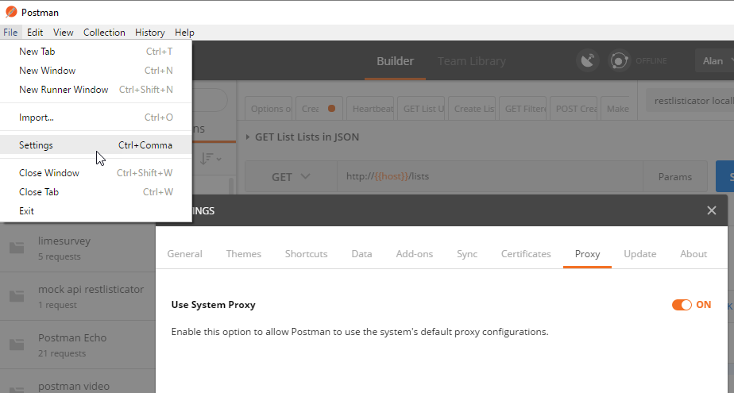
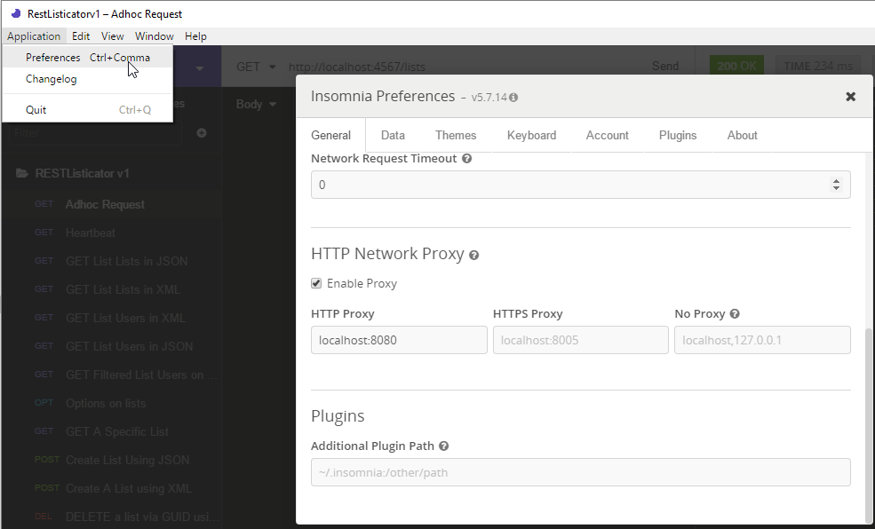
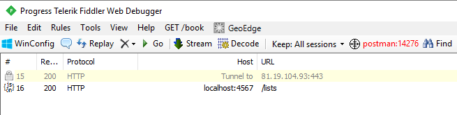
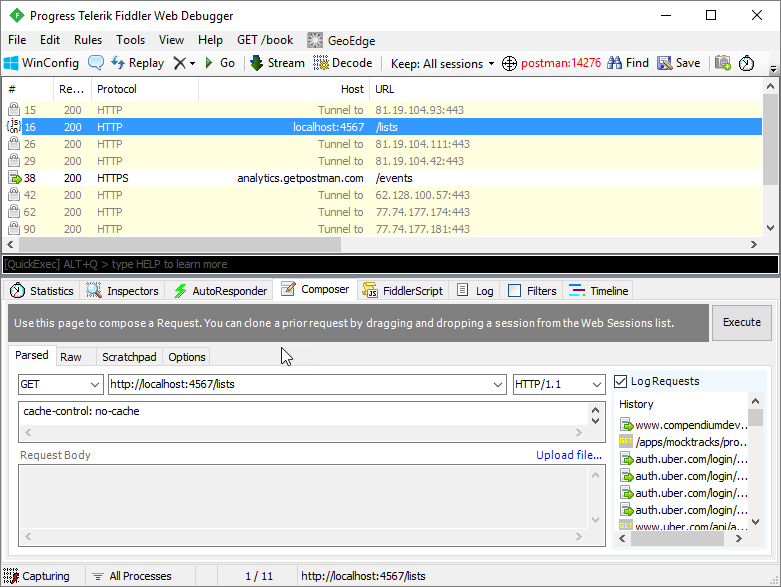
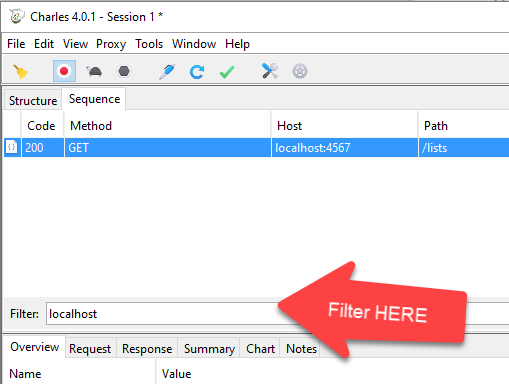
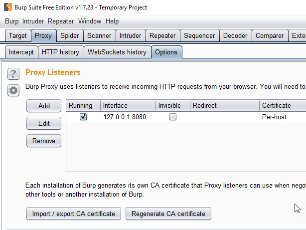
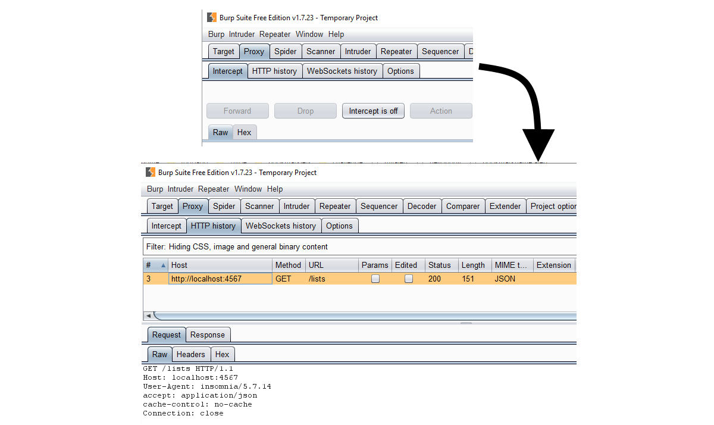
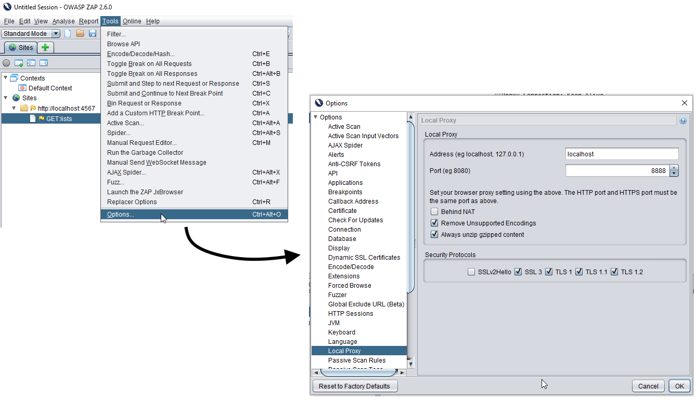
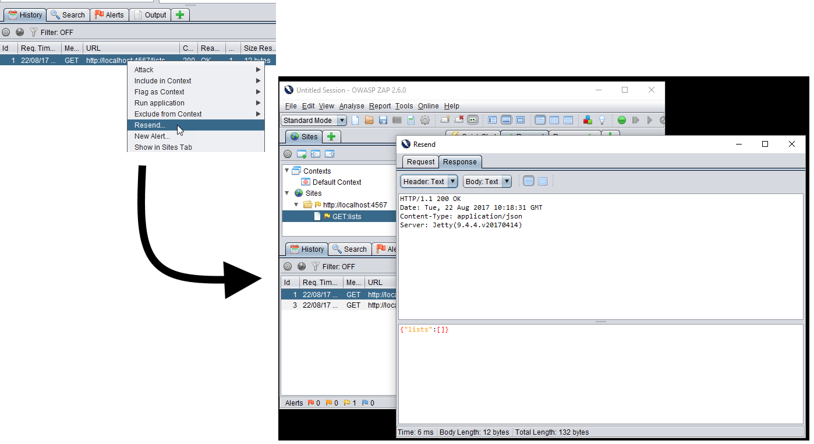
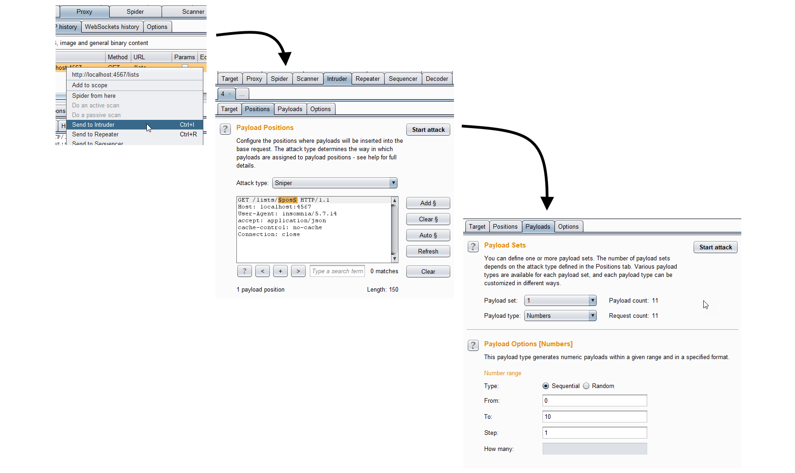

---

# SECTION - HTTP Proxies Reference

---

## Which proxies?

- [Fiddler](http://www.telerik.com/fiddler)
    - Windows (Beta: Linux, Mac)
- [Charles](https://www.charlesproxy.com/)
    - Commercial but allows 30 mins in 'shareware' mode
- [BurpSuite](https://portswigger.net/burp)
    - Free edition good enough for API Testing
- [Owasp ZAP](https://www.owasp.org/index.php/OWASP_Zed_Attack_Proxy_Project)
    - Open Source

Fiddler & Charles act as System Proxies making them easy to use with Postman.

---

## Using a Proxy with Postman

- Change Proxy Settings with "File \ Settings" and then "Proxy" tab
    - on Mac use "Postman \ Preferences" and then "Proxy" tab
- Postman can use a Global Proxy by setting the IP address and Port
    - e.g. BurpSuite, OWasp Zap (or Fiddler and Charles)
- Postman can hook into System Proxy e.g
    - Charles, Fiddler

- Otherwise start postman with `--proxy-server`

---

## Using a Proxy with Postman

---

## Setting Postman proxy from commandline

For full details see [blog post](http://blog.eviltester.com/2016/12/how-to-configure-postman-native-client.html)

- Mac (type all on one line):

~~~~~~~~
open /Applications/Postman.app --args 
      --proxy-server=localhost:8888
~~~~~~~~

- Windows:

~~~~~~~~
cd C:\Users\Alan\AppData\Local\Postman\app-4.9.3\
postman.exe --proxy-server=localhost:8888
~~~~~~~~

---

## Using a Proxy with Insomnia

- Application \ Preferences
- on Mac "Insomnia \ preferences"

---

## Use of Proxies

- Examples of Fiddler - with screenshots
- Examples of Charles with screenshots
- Examples of Owasp Zap with screenshots
- Examples of BurpSuite with screenshots

---

## Fiddler Filter Requests

- ctrl+X - to clear traffic history
- filter by process

---

## Fiddler Inspect Traffic

- Traffic shown in list - use inspectors to view request and response

---

## Fiddler listens on port 8888 by default

- find out/change port in `tools \ options`

---

## Replay Request in Fiddler

- drag request from history to Composer to edit and replay

---

## Charles Filter Requests

- Quick filter to `localhost`

---

## Charles Inspect Traffic

- inspect traffic

---

## Charles Replay Traffic

- right click 'compose'

---

## Charles port settings

- `tools \ proxy settings`

---

## BurpSuite Port Config

- tabs `proxy \ options`

---

## BurpSuite Inspect Traffic

- Ensure intecept is off, view HTTP History

---

## BurpSuite Replay Request

- right click and use repeater

---

## Owasp Zap Port Config

- `tools \ options \ local proxy`

---

## Owasp Zap Inspect Traffic

- history and 'sites', view in top right

---

## Owasp Zap Replay Request

- right click 'Resend', edit and send

---

## Fuzzing in BurpSuite

- right click, intruder, hightlight and add position, edit payload, start attack

---

## Fuzzing in Owasp ZAP

- right click, attack, fuzz, highlight and add location, add payload, start fuzzer

