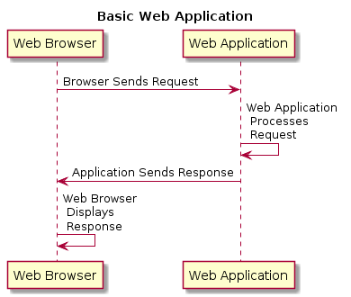
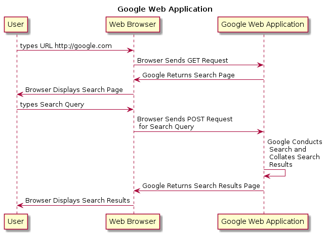
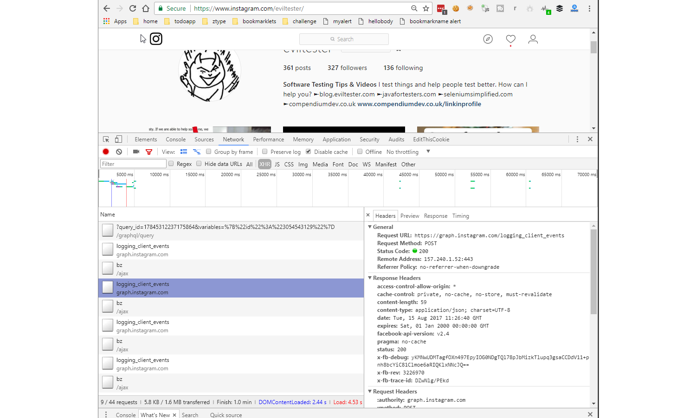

# SECTION - HTTP BASICS

---

# Overview of Section - HTTP Basics

- What is a Web Application?
- What is an HTTP Request?
- Viewing/Making HTTP Requests in Browser
- Using Browser Dev Tools

Exercises: in browser - GET, viewing traffic, Ajax requests

---

# What is a Web Application?

- A web hosted HTTP accessed application with a GUI and possibly an API

---

# Examples of Web Applications

- Google
- Twitter
- etc.

---

# Overview - Browser - Web Application

---

# Example - A Web Application

- Diagram showing browser making GET, POST requests to Server

---

# What is HTTP?

- Verbs - GET, POST, DELETE, PUT, HEAD, OPTIONS, PATCH
- URL (URI)
- Headers - cookies, accept formats, user agent, content of message, authentication, etc.
- Data contained in message body - Form, JSON, XML

---

# Example HTTP Request

use browser to GET http://compendiumdev.co.uk/apps/api/mock/reflect

Formatted for readability - headers are normally on one line.

~~~~~~~~
GET http://compendiumdev.co.uk/apps/api/mock/reflect HTTP/1.1
Host: compendiumdev.co.uk
Connection: keep-alive
Cache-Control: max-age=0
User-Agent: Mozilla/5.0 (Windows NT 10.0; Win64; x64)
            AppleWebKit/537.36 (KHTML, like Gecko)
            Chrome/60.0.3112.90 Safari/537.36
Upgrade-Insecure-Requests: 1
Accept: text/html,application/xhtml+xml,
        application/xml;q=0.9,image/webp,image/apng,*/*;q=0.8
Accept-Encoding: gzip, deflate
Accept-Language: en-US,en;q=0.8
~~~~~~~~

---

# HTTP Requests - Human or System

- Human
    - user types URL into browser search bar (GET)
    - user submits form (POST)
- System
    -System automatically polls server for new content via JavaScript
        - [AJAX](https://en.wikipedia.org/wiki/Ajax_(programming)) (Asynchronous JavaScript and XML)
            -  [XHR](https://en.wikipedia.org/wiki/XMLHttpRequest) (XML HTTP Request)
        - GET / POST
        - often returns JSON

---

# View Browser Requests in Dev Tools Network Tab

---

# Demo: View Browser Requests in Dev Tools

- [instagram.com/eviltester](https://instagram.com/eviltester)
- Chrome
    - `Inspect Element` or `ctrl+shift+i` or `tools\more tools\Developer Tools`
    - Network Tab
- Edge
    - F12 Developer tools
    - Network Tab
- Firefox
    - Inspect Element
    - Network tab

Make sure 'All' or 'XHR' is selected.

---

# Group Exercise: View Browser Requests in Dev Tools Network Tab Examples

- Twitter Feed?
    - e.g. https://twitter.com/eviltester/lists/work
- WebGraphViz?
    - e.g. http://www.webgraphviz.com/
- Instagram?
    - https://www.instagram.com/eviltester
- etc. probably app or web page that updates automatically

---

# Exercise: View Browser Requests in Dev Tools Network Tab

- Open browser, Visit a site, Open Network Tab, Inspect XHR requests
- visit a twitter feed, inspect the update XHR requests
   - e.g. https://twitter.com/eviltester/lists/work
- visit an Instagram feed, inspect the update XHR requests
    - e.g. https://www.instagram.com/eviltester/
- Find other sites, inspect the update XHR requests
    - e.g. Gmail, Ebay, what else?

---

# JavaScript AJAX/XHR Browser Risks

- Memory Leaks
- Blocking Code (JavaScript is single threaded) crashing browser
- Cross browser compatibility issues

Bonus: In Chrome try the Task Manager (shift+esc) and see if these JavaScript pages have any issues.
   - Chrome Menu \ More Tools \ Task Manager
   - ebay often has memory leaks, or just doesn't care about your browser

These risks are not present with an API.

---

# What is a Web Application?

- A web hosted HTTP accessed application with a GUI and possibly an API
- Did any of the previous Web Application examples use an API?

---

